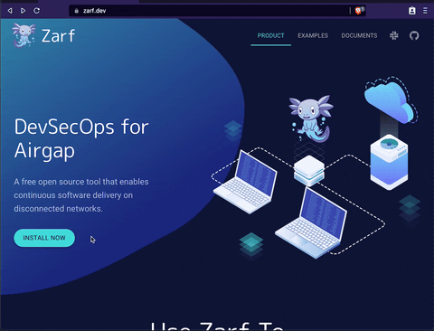

# Zarf - DevSecOps for Air Gap

Zarf eliminates the [complexity of air gap software delivery](https://www.itopstimes.com/contain/air-gap-kubernetes-considerations-for-running-cloud-native-applications-without-the-cloud/) for Kubernetes clusters and cloud-native workloads using a declarative packaging strategy to support DevSecOps in offline and semi-connected environments.

## 📦 Out of the Box Features

- Automate Kubernetes deployments in disconnected environments
- Automate [Software Bill of Materials (SBOM)](https://www.linuxfoundation.org/tools/the-state-of-software-bill-of-materials-sbom-and-cybersecurity-readiness/) generation
- Provide a [web dashboard](https://docs.zarf.dev/docs/dashboard-ui/sbom-dashboard) for viewing SBOM output
- Create and verify package signatures with [cosign](https://github.com/sigstore/cosign)
- [Publish](https://docs.zarf.dev/docs/user-guide/the-zarf-cli/cli-commands/zarf_package_publish), [pull](https://docs.zarf.dev/docs/user-guide/the-zarf-cli/cli-commands/zarf_package_pull), and [deploy](https://docs.zarf.dev/docs/user-guide/the-zarf-cli/cli-commands/zarf_package_deploy) packages from an [OCI registry](https://opencontainers.org/)
- Powerful component lifecycle [actions](https://docs.zarf.dev/docs/user-guide/component-actions)
- Deploy a new cluster while fully disconnected with [K3s](https://k3s.io/) or into any existing cluster using a [kube config](https://kubernetes.io/docs/concepts/configuration/organize-cluster-access-kubeconfig/)
- Builtin logging stack with [Loki](https://grafana.com/oss/loki/)
- Builtin Git server with [Gitea](https://gitea.com/)
- Builtin Docker registry
- Builtin [K9s Dashboard](https://k9scli.io/) for managing a cluster from the terminal
- [Mutating Webhook](adr/0005-mutating-webhook.md) to automatically update Kubernetes pod's image path and pull secrets as well as [Flux Git Repository](https://fluxcd.io/docs/components/source/gitrepositories/) URLs and secret references
- Builtin [command to find images](https://docs.zarf.dev/docs/user-guide/the-zarf-cli/cli-commands/zarf_prepare_find-images) and resources from a Helm chart
- Tunneling capability to [connect to Kuberenetes resources](https://docs.zarf.dev/docs/user-guide/the-zarf-cli/cli-commands/zarf_connect) without network routing, DNS, TLS or Ingress configuration required

## 🛠️ Configurable Features

- Customizable [variables and package templates](examples/variables/README.md) with defaults and user prompting
- [Composable packages](https://docs.zarf.dev/docs/user-guide/zarf-packages/zarf-components#composing-package-components) to include multiple sub-packages/components
- Component-level OS/architecture filtering

## Demo

_<https://www.youtube.com/watch?v=WnOYlFVVKDE>_

## Getting Started

To try Zarf out for yourself, visit the ["Try It Now"](https://zarf.dev/install) section on our website, and if you want to learn more about Zarf and its use cases visit [docs.zarf.dev](https://docs.zarf.dev/docs/zarf-overview).

From the docs you can learn more about [installation](https://docs.zarf.dev/docs/operator-manual/set-up-and-install), [using the CLI](https://docs.zarf.dev/docs/user-guide/the-zarf-cli/), [making packages](https://docs.zarf.dev/docs/user-guide/zarf-packages/), and the [Zarf package schema](https://docs.zarf.dev/docs/user-guide/zarf-schema).

Using Zarf in Github workflows? Check out the [setup-zarf](https://github.com/defenseunicorns/setup-zarf) action. Install any version of Zarf and its `init` package with zero added dependencies.

## Developing

To contribute, please see our [Contributor Guide](https://docs.zarf.dev/docs/contribute-to-zarf/contributor-guide).  Below is an architectural diagram showing the basics of how Zarf functions which you can read more about [here](https://docs.zarf.dev/docs/contribute-to-zarf/nerd-notes).

[Source DrawIO](docs/.images/architecture.drawio.svg)

## Special Thanks

> Early Zarf research and prototypes were developed jointly with [United States Naval Postgraduate School](https://nps.edu/) research you can read [here](https://calhoun.nps.edu/handle/10945/68688).

We would also like to thank the following awesome libraries and projects without which Zarf would not be possible!

