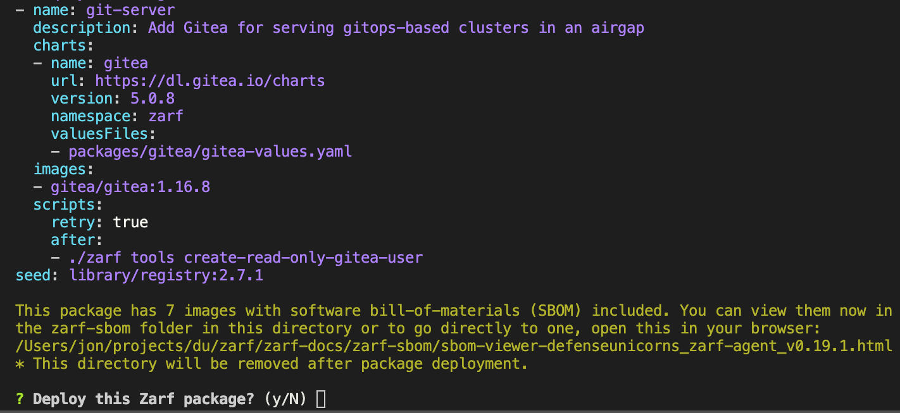

# Initializing a K8s Cluster
<!-- TODO: Is this ok to say if it's true 99% of the time? -->
Before you're able to deploy an application package to a cluster, you need to initialize the cluster. This is done by running the [`zarf init`](../4-user-guide/1-the-zarf-cli/100-cli-commands/zarf_init.md) command. The `zarf init` command uses a specialized package that we have been calling an 'init-package'. More information about this specific package can be found [here](../4-user-guide/2-zarf-packages/3-the-zarf-init-package.md).


## Walkthrough Prerequisites
1. The [Zarf](https://github.com/defenseunicorns/zarf) repository cloned: ([`git clone` Instructions](https://docs.github.com/en/repositories/creating-and-managing-repositories/cloning-a-repository))
1. Zarf binary installed on your $PATH: ([Install Instructions](../3-getting-started.md#installing-zarf))
1. An init-package built/downloaded: ([init-package Build Instructions](./0-creating-a-zarf-package.md)) or ([Download Location](https://github.com/defenseunicorns/zarf/releases))
1. A Kubernetes cluster to work with: ([Local k8s Cluster Instructions](./#setting-up-a-local-kubernetes-cluster))

## Running the init Command
<!-- TODO: Should add a note about user/pass combos that get printed out when done (and how to get those values again later) -->
Initializing a cluster is done with a single command, `zarf init`.

```bash
# Ensure you are in the directory where the init-package.tar.zst is located

zarf init       # Run the initialization command
                # Type `y` when asked if we're sure that we want to deploy the package and hit enter
                # Type `n` when asked if we want to deploy the 'k3s component' and hit enter
                # Type `n` when asked if we want to deploy the 'logging component' and hit enter (optional)
                # Type `n` when asked if we want to deploy the  'git-server component' and hit enter (optional)
```


<br />

### Confirming the Deployment
Just like how we got a prompt when creating a package in the prior walkthrough, we will also get a prompt when deploying a package.

Since there are container images within our init-package, we also get a notification about the [Software Bill of Materials (SBOM)](https://www.ntia.gov/SBOM) Zarf included for our package with a file location of where we could view the [SBOM Dashboard](../7-dashboard-ui/1-sbom-dashboard.md) if interested incase we were interested in viewing it.

<br />

### Declining The Optional Components
The init package comes with a few optional components that can be installed. For now we will ignore the optional components but more information about the init-package and its components can be found [here](../4-user-guide/2-zarf-packages/3-the-zarf-init-package.md).


<br />


### Validating the Deployment
<!-- TODO: Would a screenshot be helpful here? -->
After the `zarf init` command is done running, you should see a few new `zarf` pods in the Kubernetes cluster.
```bash
zarf tools monitor

# Note you can press `0` if you want to see all namespaces and CTRL-C to exit
```

<br />
<br />


## Cleaning Up
The [`zarf destroy`](../4-user-guide/1-the-zarf-cli/100-cli-commands/zarf_destroy.md) command will remove all of the resources that were created by the initialization command. Since this walkthrough involved a kubernetes cluster that was already existing, this command will leave you with a clean cluster that you can either destroy or use for another walkthrough.

```bash
zarf destroy --confirm
```
