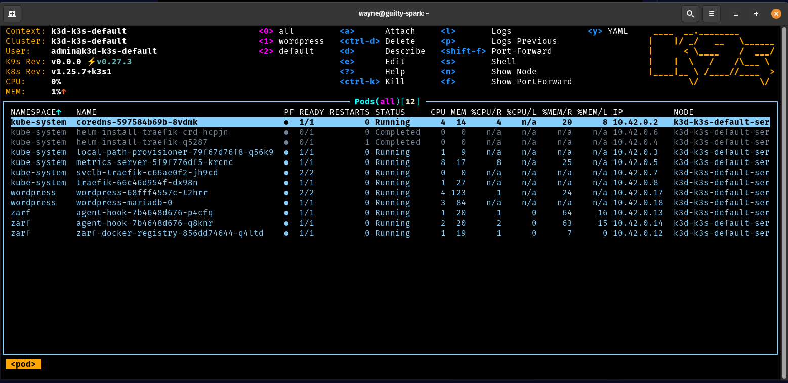

# Deploying Zarf Packages

## Introduction

In this tutorial, we are going to deploy the Helm OCI chart package onto your cluster. In previous tutorials, we learned how to [create a package](./0-using-zarf-package-create.md) and [initialize a cluster](./1-initializing-a-k8s-cluster.md). We will be leveraging all that past work and then go the extra step of deploying an application onto our cluster with the `zarf package deploy` command.

## System Requirements

- You'll need an internet connection to grab the pre-requisites (such as the Zarf source code that includes the Helm OCI chart example)

## Prerequisites

Prior to this tutorial you'll want to have a working cluster with Zarf initialized
1.  Zarf binary installed on your $PATH: ([Installing Zarf](../1-getting-started/index.md#installing-zarf))
2. [An initialized cluster](./1-initializing-a-k8s-cluster.md)
3. The [Helm OCI chart package created](./0-using-zarf-package-create.md)

## Deploying the Helm OCI chart package

1. Navigate to the folder when you created the package in a previous tutorial. (see [prerequisites](#prerequisites))

```sh
$ cd src/github.com/defenseunicorns/zarf/examples/helm-oci-chart
```

2. Use the `zarf package deploy` command to deploy the package.

<iframe src="/docs/tutorials/package_deploy_helm.html" width="100%" height="550px"></iframe>

3. If you do not provide the path to the package as an argument to the `zarf package deploy` command, Zarf will prompt you asking for you to choose which package you want to deploy. You can use the `tab` key, to be prompted for avaiable packages in the current working directory.

<iframe src="/docs/tutorials/package_deploy_suggest.html" width="100%" height="120px"></iframe>

By hitting 'tab', you can use the arrow keys to select which package you want to deploy. Since we are deploying the Helm OCI chart package in this tutorial, we will select that package and hit 'enter'.

<iframe src="/docs/tutorials/package_deploy_helm_suggestions.html" width="100%" height="150px"></iframe>

As we have seen a few times now, we are going to be prompted with a confirmation dialog asking us to confirm that we want to deploy this package onto our cluster.

<iframe src="/docs/tutorials/package_deploy_helm.html" width="100%" height="550px"></iframe>


4. If you did not use the `--confirm` flag to automatically confirm that you want to install this package, press `y` for yes.  Then hit the `enter` key.

<iframe src="/docs/tutorials/package_deploy_helm_bottom.html" width="100%" height="300px"></iframe>

5. Confirm the deployment by running `zarf tools monitor`. Once confirmed, hit `ctrl/control c` to exit.



## Removal

1. Use the `zarf package list` command to get a list of the installed packages.  This will give you the name of the Helm OCI chart package to remove it.

<iframe src="/docs/tutorials/package_deploy_helm_list.html" height="120px" width="100%"></iframe>

2. Use the `zarf package remove` command to remove the `helm-oci-chart` package.  Don't forget the `--confirm` flag.  Otherwise you'll receive an error.

<iframe src="/docs/tutorials/package_deploy_helm_no_confirm.html" width="100%" height="425px"></iframe>

3. You can also use the `zarf package remove` command with the zarf package file, to remove the package.  Again, don't forget the `--confirm` flag.

<iframe src="/docs/tutorials/package_deploy_helm_remove_by_file.html" height="100px" width="100%"></iframe>

The helm-oci-chart package has now been removed from your cluster.

## Troubleshooting

### Unable to connect to the Kubernetes cluster

#### Example

<iframe src="/docs/tutorials/troubleshoot_unreachable.html" width="100%" height="200px"></iframe>

#### Remediation

If you receive this error, either you don't have a Kubernetes cluster, your cluster is down, or your cluster is unreachable.

1. Check your kubectl configuration, then try again.  For more information about kubectl configuration see [Configure Access to Multiple Clusters](https://kubernetes.io/docs/tasks/access-application-cluster/configure-access-multiple-clusters/) from the Kubernetes documentation.

If you need to setup a cluster, you can perform the following.

1. Deploy a Kubernetes cluster with the [Creating a K8s Cluster with Zarf](./5-creating-a-k8s-cluster-with-zarf.md) tutorial.
2. Perform the [Initialize a cluster](./1-initializing-a-k8s-cluster.md) tutorial.

After that you can try deploying the package again.

### Secrets "zarf-state" not found

#### Example

<iframe src="/docs/tutorials/troubleshoot_uninitialized_helmOCI.html" width="100%" height="250px"></iframe>

#### Remediation

If you receive this error when zarf is attempting to deploy a package, this means you have not initialized the kubernetes cluster.  This is one of the prerequisites for this tutorial.  Perform the [Initialize a cluster](./1-initializing-a-k8s-cluster.md) tutorial, then try again.
