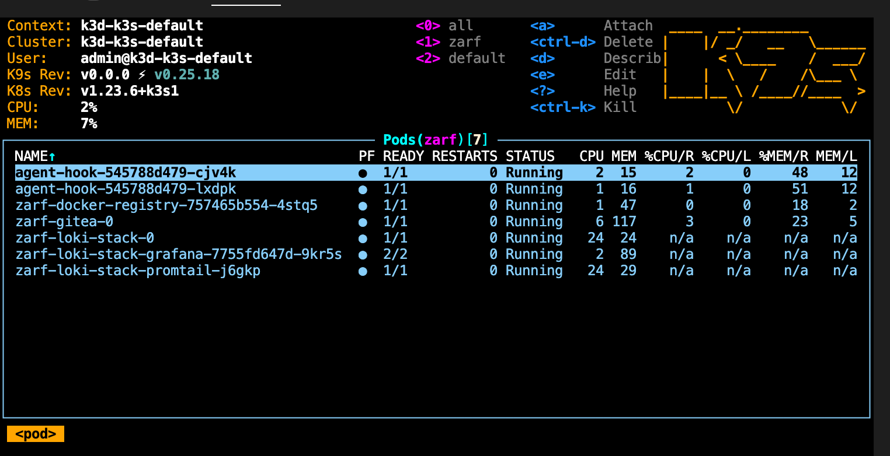

# Zarf Deploy UI

Zarf has a UI built into the go binary to supports a nubmer of deployment features. The Zarf Deployment UI offers a differnt experience to deploy and manage Zarf clusters and packages. The UI can be used to connect to connect to existing clusters (via a Kubeconfig), initalize a cluster, deploy packages into a cluster, update packages in the cluster, and remove packages from the cluster. The UI makes Zarfs deployment capabilities more accesible to users who are less familuar with CLI and Kubernetes. Since this tool is embedded in the Zarf binary, you don't have to worry about additional dependencies or trying to install it yourself!

## Technical Details

The Zarf Deployment UI can be easily spun up with a single command from the CLI terminal. The UI is served through your machines local browser, running as a local host, with the CLI tool running on the backend. The Zarf Deployment UI mirros the functionality of the Zarf CLI commands, but with a more intuitive flow and familuar user patterns for non-technical users. The UI does not offer any additional commands or core functionaliity to Zarf. 

Use the Zarf Deployment UI to execute the existing Zarf CLI commands. 
- [Zarf tools Kubectl](/docs/4-user-guide/1-the-zarf-cli/100-cli-commands/zarf_tools_kubectl.md)
- [Zarf tools Kubctl top](/docs/4-user-guide/1-the-zarf-cli/100-cli-commands/)
- [Zarf Init](/docs/4-user-guide/1-the-zarf-cli/100-cli-commands/zarf_init.md)
- [Zarf Package Deploy](/docs/4-user-guide/1-the-zarf-cli/100-cli-commands/)
- [Zarf Package Remove](/docs/4-user-guide/1-the-zarf-cli/100-cli-commands/zarf_package_remove.md)
- [Zarf Pacakge List](/docs/4-user-guide/1-the-zarf-cli/100-cli-commands/zarf_package_list.md)
- [Zarf Package Inspect](/docs/4-user-guide/1-the-zarf-cli/100-cli-commands/zarf_package_inspect.md) (coming soon)
- [Zarf Tools Sbom](/docs/4-user-guide/1-the-zarf-cli/100-cli-commands/zarf_tools_sbom.md) (Coming soon)
- [Zarf Connect](/docs/4-user-guide/1-the-zarf-cli/100-cli-commands/zarf_connect.md) (coming soon)

* All other commands will require interfacing with the CLI. 

## Using the Zarf Deployment UI

To use the Zarf Deployment UI:

1. Have a zarf binary installed
2. Open CLI terminal

Launch the Zarf Deployment UI using a single command!

```bash
zarf dev UI
```

**Example Zarf Deployment UI**


More instructions on how to use the [Zarf Deployment UI Tutorial](insert.link.here)

Questions:
- Should we call it Zarf deployment UI - to better imply why function it does
- Should it be in UI Dashboards or up with Deploy package (vote with deploy package)
- Need tutorial? or just add tutorial video here
- Connect to Existing Cluster 
- Deploy K8 and Cluster with init package with Cluster
- Select optional components
- Deploy additional packages